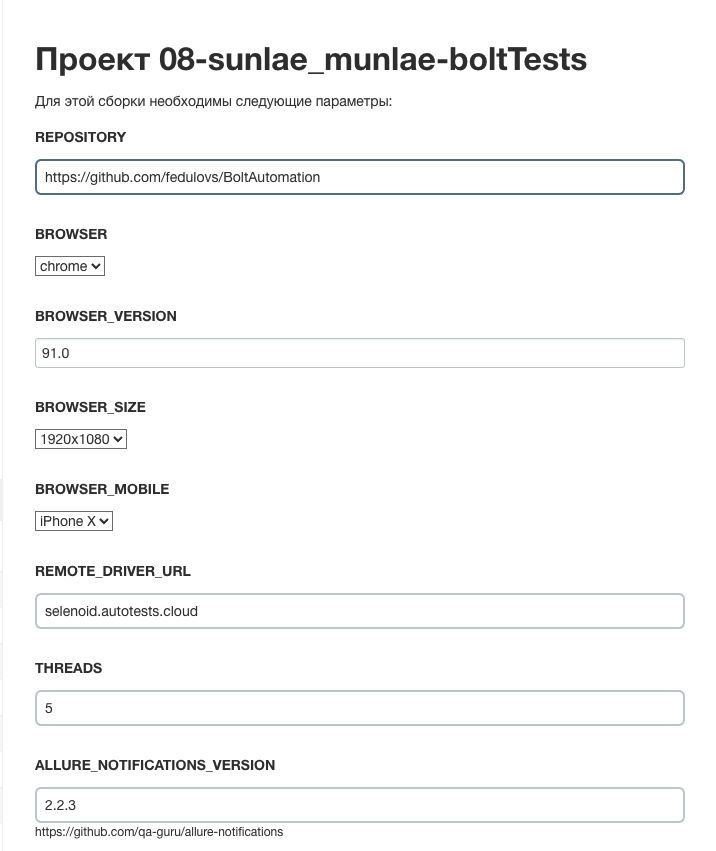
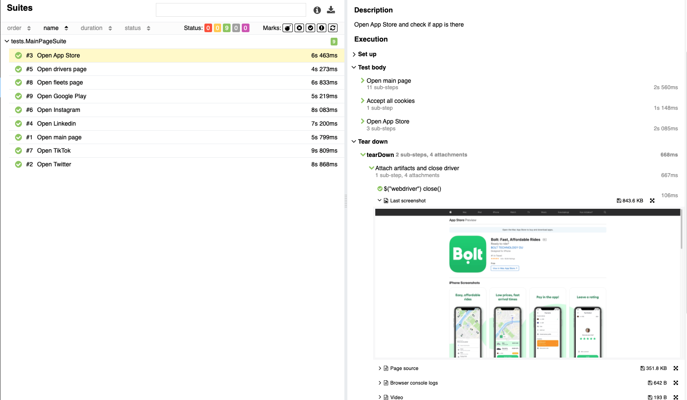

<code></code>

# Bolt web automation project
### UI tests for https://bolt.eu/
## Technology Stack:

| Java | Selenide | Gradle | Junit5 | Selenoid | Jenkins | IntelliJ IDEA | Allure Report | Allure Testops | Telegram |
|:------:|:----:|:------:|:------:|:--------:|:--------:|:-------------:|:---------:|:---------:|:--------:|
|  |  |  |  |  |  |  |  |  |  |

## Description

You can run tests by configuring the following parameters:

* BROWSER (default chrome)
* BROWSER_VERSION (default 89.0)
* BROWSER_SIZE (default 1920x1080)
* REMOTE_DRIVER_URL (url address of selenoid or grid)
* THREADS (number of threads to run)
* ALLURE_NOTIFICATIONS_VERSION

  

### To run tests locally with files app.properties and local.properties:

```
gradle clean test 
```

## Allure reports

### Overview


### Test with steps, attached image, video, page source and console logs



### Video


## Allure TestOps

## Launches


## Test Cases


## Jira integration


## Telegram report


