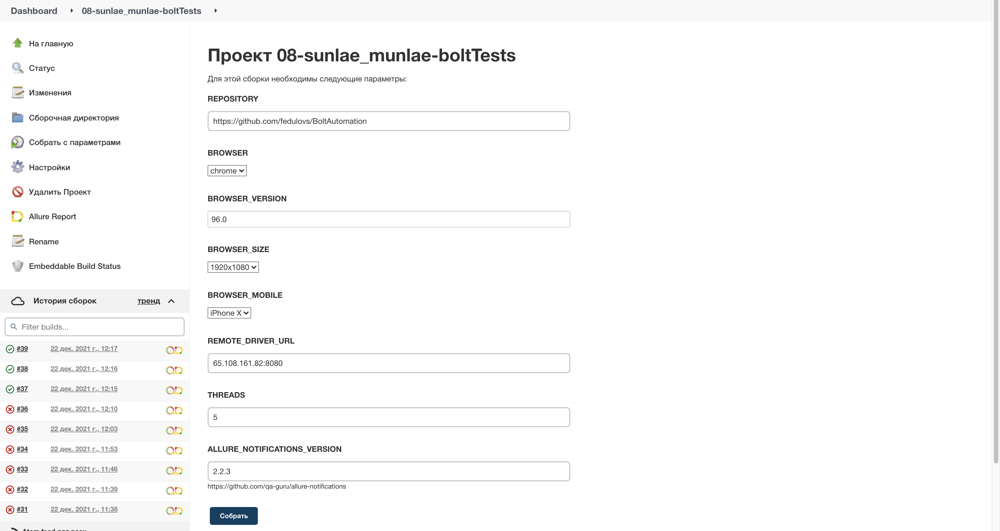
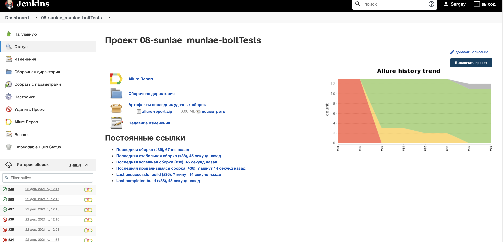
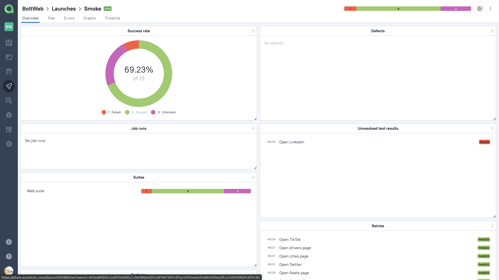
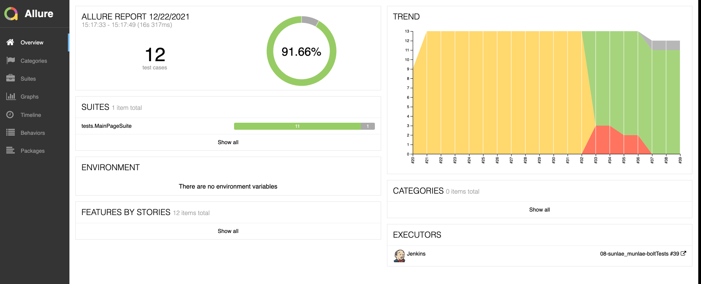
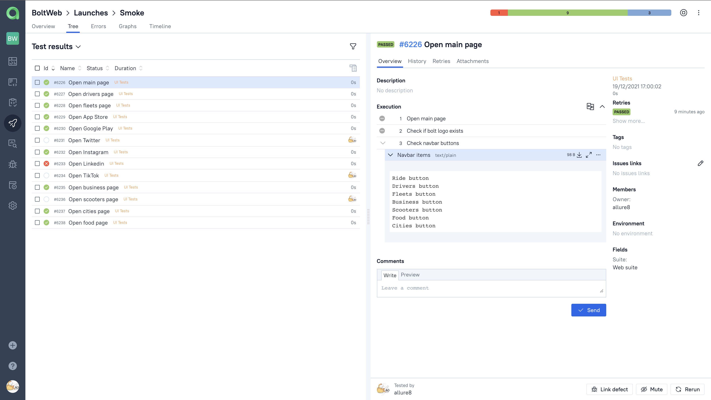
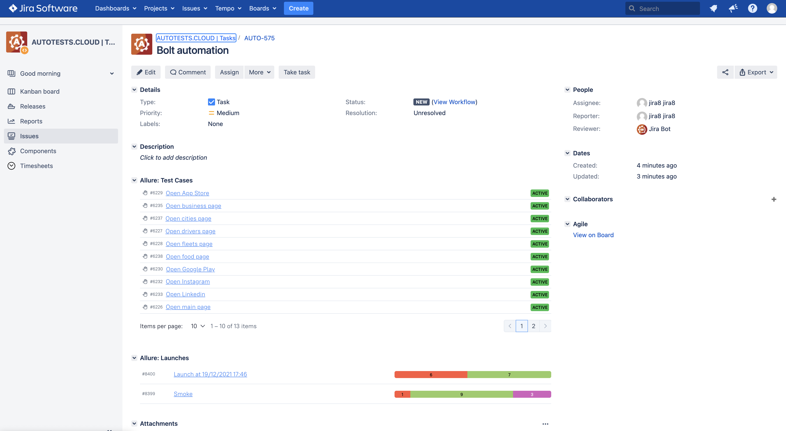
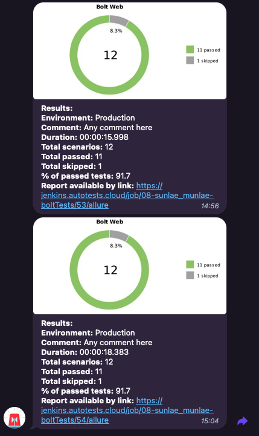

<code></code>

# Bolt web automation project
### UI tests for https://bolt.eu/
## Technology Stack:

| Java | Selenide | Gradle | Junit5 | Selenoid | Jenkins | IntelliJ IDEA | Allure Report | Allure Testops | Telegram |
|:------:|:----:|:------:|:------:|:--------:|:--------:|:-------------:|:---------:|:---------:|:--------:|
|  |  |  |  |  |  |  |  |  |  |

## Description

You can run tests by configuring the following parameters:

* BROWSER (default chrome)
* BROWSER_VERSION (default 89.0)
* BROWSER_SIZE (default 1920x1080)
* REMOTE_DRIVER_URL (url address of selenoid or grid)
* THREADS (number of threads to run)
* ALLURE_NOTIFICATIONS_VERSION

  

### To run tests locally with files app.properties and local.properties:

```
gradle clean test 
```

## Allure reports

### Overview



### Test with steps, attached image, video, page source and console logs


### Video


## Allure [TestOps](https://allure.autotests.cloud/project/794/test-cases?treeId=1524/ "TestOps") 

_Each launch displays it's details in Allure TMS in live regime_



## Launches



## Test Cases



## Jira integration

_Tests and runs could be integrated with Jira and attached to specific task_



## Telegram report



